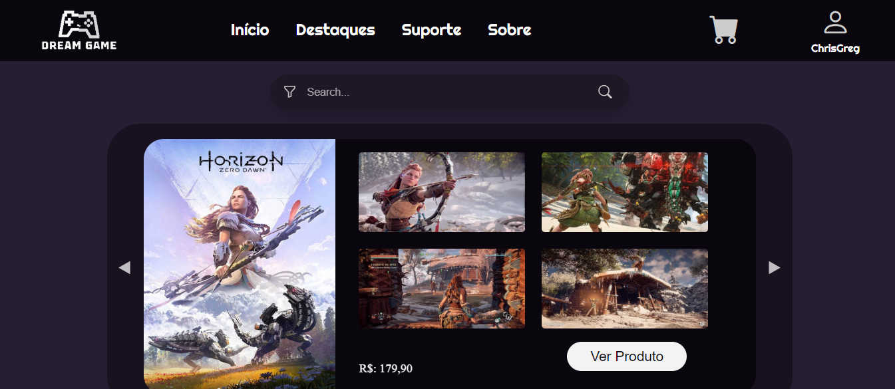

# 🎮 Dream Game


> Projeto acadêmico de uma loja virtual de jogos, com funcionalidades completas como login, busca com filtros, carrinho de compras e finalização de compra. Interface moderna.

---

# ✅ Ajustes e Melhorias do Projeto

O projeto está em andamento e conta com diversas funcionalidades concluídas e outras em desenvolvimento. Abaixo está a lista organizada por telas:

---

### 🏠 Tela Inicial
- [x] **Header**
  - [x] Menu de Navegação
    - [x] Início
    - [x] Produtos
    - [x] Contato
    - [x] Sobre
  - [x] Menu Hamburguer
  - [x] Barra de Pesquisa
    - [x] Ícone de Filtro
    - [ ] Redireciona para a tela do produto pesquisado ou para a tela de pesquisa caso não encontre resultados
- [x] **Banner**
  - [x] Imagens promocionais
  - [x] Botão de Compra leva para a tela do produto em destaque
- [ ] **Área de Produtos**
  - [ ] Lista de produtos com links para suas páginas
- [x] **Footer**
  - [x] Informações de direitos autorais

---

### 🧾 Tela de Produtos
- [x] Header
- [ ] Lista de Produtos
  - [ ] Imagem do produto
  - [ ] Nome e preço
  - [ ] Botão "Comprar" redirecionando para a tela do produto
- [x] Footer

---

### 💬 Tela de Suporte
- [x] Header
- [x] Título e Subtítulo
- [x] Opções de Suporte
  - [x] Relatar um problema (formulário)
  - [x] Dúvidas sobre pedidos
  - [x] Problemas de acesso
  - [x] Outros problemas (formulário personalizado)
- [x] Ícones de Ajuda

---

### 🔎 Tela de Pesquisa
- [x] Header
- [x] Barra de Pesquisa
- [ ] Resultados de Produtos
- [ ] Filtros (gênero, ano, valor)

---

### 👤 Tela de Perfil
- [x] Header
- [ ] Opções para edição do perfil
- [x] Footer

---

### 📝 Tela de Cadastro e Login

#### Cadastro
- [x] Logo
- [x] Formulário de Cadastro
  - [x] **Apelido (Nickname)**:
    - [x] Obrigatório
    - [x] Entre 3 e 20 caracteres (letras, números e `_`)
  - [x] **Nome Completo**:
    - [x] Obrigatório
    - [x] Deve conter pelo menos nome e sobrenome
  - [x] **Data de Nascimento**:
    - [x] Obrigatória
    - [x] Formato: dd/mm/aaaa
    - [x] Usuário deve ter pelo menos 13 anos
  - [x] **Email**:
    - [x] Obrigatório
    - [x] Formato válido (ex: exemplo@dominio.com)
    - [x] Verificação de email duplicado
  - [x] **Senha**:
    - [x] Obrigatória
    - [x] Mínimo de 8 caracteres
    - [x] Pelo menos uma letra maiúscula, uma minúscula, um número e um caractere especial
  - [x] **Confirmação de Senha**:
    - [x] Deve coincidir com a senha informada
  - [x] **Botão "Cadastrar"**:
    - [x] Só funciona se todos os campos estiverem corretos

#### Login
- [x] **Email:**
  - [x] Formato válido e obrigatório
  - [x] Mensagens de erro apropriadas
- [x] **Senha:**
  - [x] Mínimo de 6 caracteres
  - [x] Campo obrigatório
  - [x] Mensagens de erro apropriadas
- [x] **Botão "Entrar":**
  - [x] Valida credenciais
  - [x] Redireciona para a tela inicial ao logar com sucesso
- [x] **Botão "Cadastrar-se":**
  - [x] Evita emails duplicados
  - [x] Redireciona para a tela de cadastro

---

### 🖥️ Telas em C# (Sistema Administrativo)
- [x] Tela de Login
- [ ] Tela de Cadastro
- [ ] Tela de Editar Produto
- [ ] Tela de Editar Usuário

---

## 💻 Pré-requisitos

Antes de começar, certifique-se de ter os seguintes itens instalados:

- **PHP 8.2 ou superior**
- **MySQL / MariaDB**
- **Servidor local (XAMPP, WAMP, Laragon ou similar)**
- **Navegador web moderno (Chrome, Firefox, etc.)**

O projeto foi testado no sistema **Windows**, mas deve funcionar também no **Linux** ou **MacOS** com configurações equivalentes.

---

## ☕ Usando Dream Game

### 1. Clone o projeto:

```bash
git clone https://github.com/lean1000/DREAM-GAME.git
```
---

### 2. Configure o Banco de Dados:
- Crie um banco chamado db_dreamgame no seu phpMyAdmin
- Importe o arquivo db_dreamgame.sql da pasta database/
---
### 3. Inicie o Servidor Local:
- Abra seu navegador e acesse:

```bash
http://localhost/DREAM-GAME/DreamGame/index.php
```
---

## 🎮 Funcionalidades WebSite

- 🔍 **Busca de jogos com filtros avançados**
- 🧾 **Página de produto** com descrição, avaliação e botão de compra
- 🛒 **Carrinho** com armazenamento em `localStorage`
- 👤 **Sistema completo de autenticação** (login, cadastro, recuperação de senha)
- 🧠 **Validações com JavaScript em tempo real** no cadastro
- ✅ **Finalização de compra** com verificação de login
- ⭐ **Exibição de avaliações com estrelas dinâmicas**

---

## ⚙️ Funcionalidades C# Administrador

- 🔍 **Filtro de busca para adiministrar usuario**
- 🔍 **Filtro de busca para adiministrar produto**
- 🛠️ **Editar** informaçoes do usuario
- 🛠️ **Editar** informaçoes do produto
- 📝 **Cadasro** de produtos

---

## 🤝 Colaboradores

Integrantes que desenvolveram este projeto:

<table>
  <tr>
    <td align="center">
      <br/>
      <sub><b>Leandro Piai Barreto</b></sub>
    </td>
    <td align="center">
      <br/>
      <sub><b>Thiago Bispo Souza</b></sub>
    </td>
  </tr>
</table>

---

## 📸 Imagem do Projeto



---

## 📄 Licença

Este projeto é de uso **acadêmico** e **não possui fins comerciais**.
